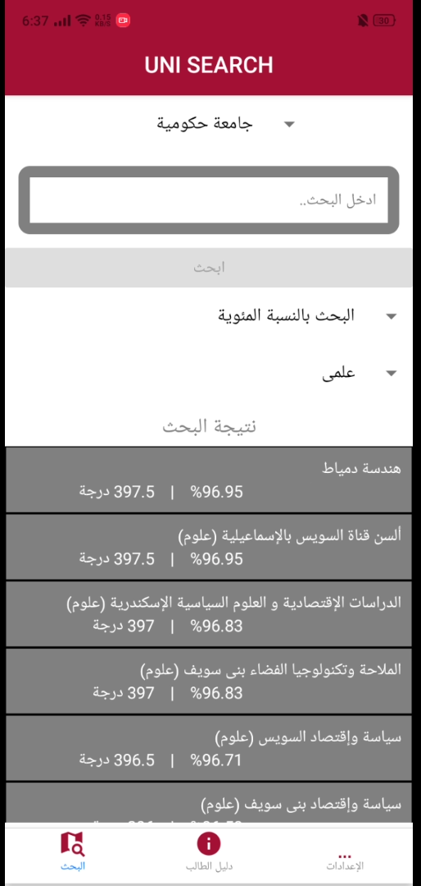

# UniSearch-Egypt

Uni Search is a search engine application which alows you to search among hundreds of institutions and universities including public and private ones.
You can search by university name, high school grade or percentage.

Download the app on google play --> https://play.google.com/store/apps/details?id=com.egyptiantechandtrends.uni_search

---

## Preview

---

## Contributors ✨

<!-- ALL-CONTRIBUTORS-LIST:START - Do not remove or modify this section -->
<!-- prettier-ignore-start -->
<!-- markdownlint-disable -->
<table>
  <tr>
    <td align="center"><a href="https://github.com/ahmedfarag9"> <b>Ahmed Farag</b></a>  </td>
    <td align="center"><a href="https://github.com/mustafafarag"> <b>Mustafa Farag</b></a>  </td>
  </tr>
</table>

<!-- markdownlint-enable -->
<!-- prettier-ignore-end -->

<!-- ALL-CONTRIBUTORS-LIST:END -->
